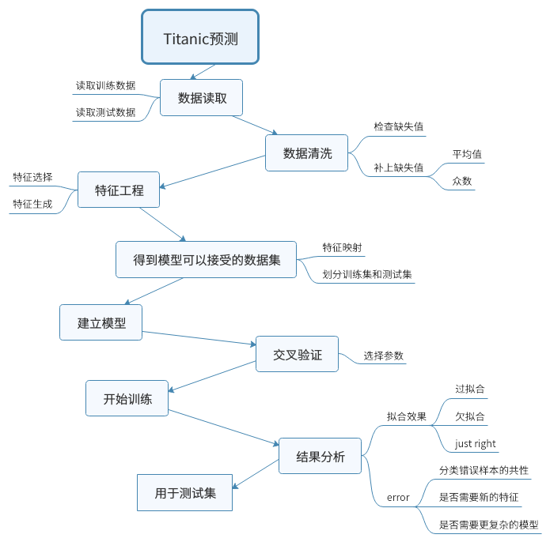

##  Titanic
这是我的第一个Kaggle题目
#### 模型：Logistic Regression
#### Score：0.76555
#### 排名：8209
#### 流程：

### Logistic Regression


$X\in R^{m\times n}$，$m$是样本数量，$y\in R^{m\times1}$是$X$的标签，$h_{\theta}(X) = \frac{1}{1+e^{-X\theta}}$，$\lambda$是正则化参数
##### 损失函数


$J = -\frac{1}{m}[y^{T}log(h_{\theta}(X))+(1-y)^{T}log(1-log(h_{\theta}(X)))]+\frac{\lambda}{2m}\sum_{i=1}^{n}\theta_{i}^{2}$
##### 梯度


$\frac{\partial J}{\partial \theta} = \frac{1}{m}X^{T}(h_{\theta}(X)-y)+\frac{\lambda}{m}\theta$
**注**:$\theta_{0}$没有正则化项
##### 迭代方法


$\theta = \theta - \alpha \frac{\partial J}{\partial \theta}$
**注**:$\theta_{0}$没有正则化项

具体的过程见mysolution.ipynb文件
其中的notebook.ipynb来自[这个链接](https://www.kaggle.com/jotham91/titanic-code-2-may-18/code)
是我在完成自己的模型之后看到的别人的一个很好的实现，所以拷贝下来用以学习
**总结**：
* *pandas*中有很多较好的数据显示和预处理的函数，无需自己手动编写如
```
dataset.isnull().sum() # 统计数据中的空值
dataset['Fare'].fillna(value=dataset['Fare'].median(), inplace=True) # 使用平均数填满空值
dataset['Embarked'].fillna(value=dataset['Embarked'].mode()[0], inplace=True) # 使用众数填满空值
data['Title'] = data['Name'].str.split(', ',expand=True) # 分割字符串到新的列中
```
* **数据预处理**时，对训练数据和测试数据**一起**预处理，之后输入测试数据时，无需再次处理
* 数据预处理部分不要和模型的部分耦合，数据处理的结果是所有模型都可以接受的，对于特别的模型所需要的数据格式，应当在模型内处理（比如logistic回归可以使用高次多项式，但是数据预处理时不要增加高次特征，高次特征的增加放在模型内部，这样使用别的模型时，之前的处理结果仍然可以使用）
* logistic回归中，高次特征的增加应该放在数据标准化**之前**，否则标准化的高次特征很容易**下溢**
* **1. is not 1**，numpy.ones 等默认的dtype是float64，在进行标签比对的时候如果使用**is**，则会比较失败，当你更改一个dtype是float64的array时，即便令其等于一个整数，整数仍然以float64呈现
* *python* 中有*itertools*可以帮助实现构造高维特征
```
        m, n = X.shape
        for i in itertools.combinations_with_replacement(list(range(n)),order):# 从1~n中可重复地取order个元素，返回一个元组的迭代器
            feature = np.ones(m)
            for j in range(order):
                feature *= X[:,i[j]]
            feature = feature.reshape((-1,1))
            X = np.hstack((X,feature))
```
* *numpy* 中的 *shape=(n,)* 和 *shape=(n,1)* 的数组是有毒的，矩阵计算结果如果是一个列向量（比如$Ax=b$），则其 *shape=(n,1)* ， *shape=(n,)* 的向量会被当做一个行向量处理，而 *shape=(n,1)* 的向量会被当成是一个列向量处理，因此如果直接将二者相加或相乘，会得到一个矩阵而非对应元素相加相乘的结果，且不会出现异常，因此在处理向量运算时，一定要确认两个向量的维数，可以通过 *a.reshape(n,1)* 将向量转化为列向量之后再处理，通常，在使用 *np.ones，np.zeros* 等初始化的时候，最好也使用二维进行初始化，防止之后的加减或比较的运算出现意想不到的错误
* 原来Mr,Mrs...也可以当做特征.....
